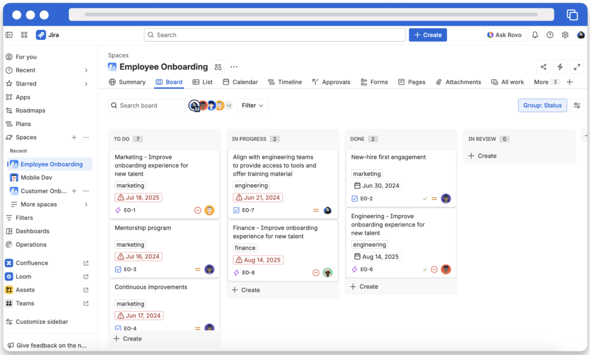

<!-- _class: lead -->

# Sessione 1: Fondamenti di Jira

**Architettura, navigazione, work item e workflow base**

Corso Atlassian: Jira e Confluence Best Practices 2026
Tyvak International

> Samuel Perini, docente a Kinetikon

---

<style scoped>
  section { font-size: 26px; }
</style>

# Agenda

| Blocco | Argomento | Dettaglio |
|--------|-----------|-----------|
| **1** | Architettura e Navigazione | Panoramica Atlassian, architettura Jira, navigazione dell'interfaccia |
| | Esercizi Blocco 1 |  |
| **2** | Elementi Jira | Tipi di spazio, di lavoro e workflow |
| | Esercizi Blocco 2 |  |

---

<!-- _class: lead -->

# Blocco 1
## Architettura e Navigazione

---

# Cos'è Jira?

---

# Cos'è Jira?

- Piattaforma centralizzata per la **pianificazione**, **organizzazione** e **tracciamento** del lavoro
- Utilizzata da team software, IT, Marketing e altri
- Facilita la **collaborazione** e **condivisione** tra teams
- Aiuta a prendere **decisioni basate sui dati** e migliorare i processi
- Parte dell'ecosistema **Atlassian**: Jira, Confluence, Jira Service Management

---

<style scoped>
  section { font-size: 22px; }
</style>

# Architettura di Jira

### Gerarchia

```
Sito Atlassian (tyvak.atlassian.net)
  └── Spazio (Space) → contenitore logico per il lavoro
       └── Board (Scrum / Kanban) → visualizzazione del lavoro
            └── Elemento di lavoro (Work Item) → unità di lavoro
```

### Schema

Ogni **spazio** è collegato a uno **schema** che definisce:
- Quali **tipi di lavoro** (work item) sono disponibili
- Quale **workflow** si applica a ciascun tipo
- Quali **schermate** (screen) mostrare per creazione/modifica
- Quali **permessi** regolano l'accesso
- Quali **notifiche** vengono inviate per quali eventi

---

# Quali tipi di lavoro (work item) esistono?

---
<style scoped>
  section { font-size: 24px; }
</style>

# Tipi di lavoro (work item)

| Tipo | Descrizione | Esempio Tyvak |
|------|-------------|---------------|
| **Epic** | Iniziativa ampia, raggruppa altri elementi | Missione KINETIKON |
| **Story** | Requisito o funzionalità da realizzare | "Definire checklist onboarding" |
| **Task** | Attività operativa concreta | "Configurare VPN nuovo dipendente" |
| **Bug** | Problema da risolvere | "Stampante non raggiungibile" |
| **Sub-task** | Sotto-attività di un elemento di lavoro padre | Singolo step di una Task |

I tipi di lavoro sono configurabili: è possibile crearne di **custom** per esigenze specifiche.

---

<style scoped>
  section { font-size: 24px; }
</style>

# Tipi di workflow

Il **Workflow Scheme** collega ogni tipo di lavoro al suo workflow.

| Tipo di workflow | Descrizione | Uso tipico |
|------------------|-------------|------------|
| **Predefinito** | To Do → In Progress → Done | Nuovi spazi, processi semplici |
| **Personalizzato** | Stati e transizioni su misura | Processi con approvazione, review, ecc. |

- **Team-managed**: workflow configurabile direttamente nella board
- **Company-managed**: workflow gestito tramite scheme, condivisibile tra spazi

> Approfondimento: personalizzazione workflow in **Sessione 4**.

---



---

<style scoped>
  section { font-size: 24px; }
</style>

# Tipi di schermata (Screen)

Lo **Screen Scheme** definisce quali campi sono visibili per ciascuna operazione su un work item.

| Contesto | Quando appare | Esempio campi |
|----------|---------------|---------------|
| **Create** | Creazione di un nuovo work item | Summary, Tipo, Priorità, Assegnatario |
| **Edit** | Modifica di un work item | Tutti i campi modificabili |
| **View** | Visualizzazione di un work item | Tutti i campi inclusi quelli di sola lettura |

- **Team-managed**: campi gestiti direttamente per tipo di lavoro
- **Company-managed**: schermate configurate tramite scheme centralizzati

> Approfondimento: configurazione schermate in **Sessione 4**.

---

<style scoped>
  section { font-size: 22px; }
</style>

# Tipi di permesso (Permission)

I permessi in Jira si dividono in due livelli:
- **Globali**: azioni a livello di sito (es. creare spazi, gestire utenti)
- **Di spazio**: azioni all'interno di un singolo spazio, definite dal **Permission Scheme**

| Permesso di spazio | Azione |
|--------------------|--------|
| **Browse** | Visualizzare lo spazio e i work item |
| **Create** | Creare nuovi work item |
| **Edit** | Modificare work item esistenti |
| **Assign** | Assegnare work item ad altri utenti |
| **Transition** | Cambiare lo stato di un work item |

> Approfondimento: gestione permessi e ruoli in **Sessione 4**.

---

# Navigazione dell'interfaccia

### Sidebar di navigazione sinistra

- **For you**: la tua area di lavoro personale (elementi assegnati, recenti, preferiti)
- **Spazi**: accesso rapido agli spazi visitati di recente e a quelli preferiti
- **Apps**: ricerca e accesso alle app integrate (es. smart checklists)
- **Filtri**: filtri salvati per ricerche frequenti
- **Dashboards**: panoramiche personalizzate dei dati
- **Personalizza barra laterale**: trascina gli elementi per visualizzarli, riordinarli o nasconderli

---

# Navigazione dell'interfaccia

### Barra superiore (space toolbar)

- **Summary**: panoramica dei progressi dello spazio (es. % completamento, work item aperti)
- **List**: visualizzazione tabellare di tutti i work item dello spazio
- **Board**: visualizzazione principale del lavoro (Scrum o Kanban)
- **Calendario**: visualizzazione temporale degli elementi con date (es. scadenze, sprint)
- **Timeline**: la visualizzazione della linea temporale aiuta a visualizzare i tempi, la durata e le dipendenze delle attività all'interno dello spazio

---

# Navigazione dell'interfaccia

### Elementi chiave

- **Notifiche**: avvisi su menzioni, assegnazioni, aggiornamenti
- **Ricerca globale rapida**: cerca ovunque in Jira
- **Impostazioni dello spazio**: configurazione e amministrazione (per chi ha permessi)

### Shortcut utili

| Shortcut | Azione |
|----------|--------|
| `/` | Ricerca globale rapida |
| `c` | Crea nuovo elemento di lavoro |

---

# Esercizi Blocco 1

### Navigazione + ricerca base

---

<!-- _class: lead -->

# Blocco 2
## Tipi di spazio, elementi di lavoro e Workflow

---

<style scoped>
  section { font-size: 24px; }
</style>

# Tipi di spazio (Space Type)

### Team-managed

- Configurazione **semplificata**, gestita dal team
- Workflow, campi e permessi indipendenti dallo schema globale
- Ideale per team autonomi con esigenze specifiche

### Company-managed

- Configurazione **centralizzata** dall'amministratore
- Workflow, schermate e permessi gestiti tramite schemi condivisi
- Ideale per processi aziendali standardizzati

---

<style scoped>
  section { font-size: 24px; }
</style>

# Tipi di spazio (Space Type)

## Quando usare quale?

| Criterio | Team-managed | Company-managed |
|----------|-------------|-----------------|
| **Controllo** | Il team decide | L'admin decide |
| **Complessità** | Bassa | Media-alta |
| **Standardizzazione** | Flessibile | Uniforme |
| **Esempio Tyvak** | ? | ? |

---

<!-- _class: lead -->

# Elementi di lavoro (Work Item)

---

<style scoped>
  section { font-size: 24px; }
</style>

# Anatomia di un elemento di lavoro (work item)

### Campi standard

| Campo | Descrizione |
|-------|-------------|
| **Summary** | Titolo dell'elemento di lavoro |
| **Tipo di lavoro** | Task, Bug, Story, Epic, Sub-task |
| **Descrizione** | Dettagli e informazioni aggiuntive |
| **Status** | Stato nel workflow (es. To Do, In Progress, Done) |
| **Assegnatario** | Persona responsabile |
| **Reporter** | Chi ha creato l'elemento |
| **Priorità** | Lowest → Low → Medium → High → Highest |
| **Etichette** | Tag liberi per categorizzare |
| **Data di scadenza** | Data entro cui completare |

Oltre ai campi standard, è possibile aggiungere **campi custom**.

---

<style scoped>
  section { font-size: 24px; }
</style>

# Relazioni tra elementi di lavoro

### Tipi di relazione

- **Sotto-attività**: elemento figlio di un elemento padre
- **Collegamento** (link): relazione tra elementi indipendenti
  - "is related to" indica una relazione generica
  - "is blocked by" / "blocks" indica una dipendenza
  - "is cloned by" / "clones" indica una copia
- **Epic link**: collegamento di un elemento alla sua Epic

### Interazioni

- **Commenti**: discussione sull'elemento, con supporto per menzioni (`@nome`)
- **Allegati**: file, screenshot, documenti
- **Cronologia** (Activity): registro di tutte le modifiche

---

<style scoped>
  section { font-size: 24px; }
</style>

# Workflow base

### Cos'è un workflow?

Un workflow definisce il **ciclo di vita** di un elemento di lavoro attraverso **stati** e **transizioni**.

### Workflow predefinito di Jira

```
┌──────────┐     ┌──────────────┐     ┌──────────┐
│  To Do   │ ──→ │ In Progress  │ ──→ │   Done   │
└──────────┘     └──────────────┘     └──────────┘
```

- Ogni **elemento di lavoro** attraversa questi stati
- Le **transizioni** definiscono i passaggi permessi tra stati
- Ogni **spazio** può avere il proprio workflow

### Stati personalizzati

Per adattare il workflow al proprio processo (es. "In Review", "Waiting for Approval")

---

<style scoped>
  section { font-size: 24px; }
</style>

# Best practice per i workflow

- **Semplicità**: massimo 6-7 stati per workflow
- **Nomi chiari**: ogni stato deve essere comprensibile a tutti
- **Transizioni esplicite**: definire chiaramente chi può spostare e quando
- **Coerenza**: stessi nomi di stato tra spazi simili

### Esempio Tyvak ?

---

# Esercizi Blocco 2

### Creazione e gestione work item

---

<style scoped>
  section { font-size: 22px; }
</style>

# Recap Sessione 1

### Concetti chiave

- **Architettura**: Sito → Spazio → Board → Elemento di lavoro
- **Tipi di spazio**: Team-managed vs Company-managed
- **Tipi di lavoro**: Epic, Story, Task, Bug, Sub-task
- **Elementi di lavoro**: campi, priorità, etichette, relazioni
- **Workflow**: stati, transizioni, personalizzazione

### Prossima sessione

**Sessione 2: Filtri, Ricerche e JQL**
- Ricerca base e avanzata
- Sintassi JQL (operatori, funzioni)
- Filtri salvati e sottoscrizioni

> **Nota:** in JQL i termini `project` e `issuetype` restano validi per retrocompatibilità, anche se l'interfaccia ora usa "spazio" e "tipo di lavoro".
